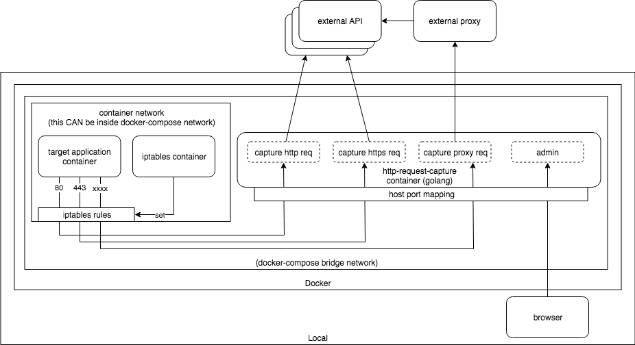
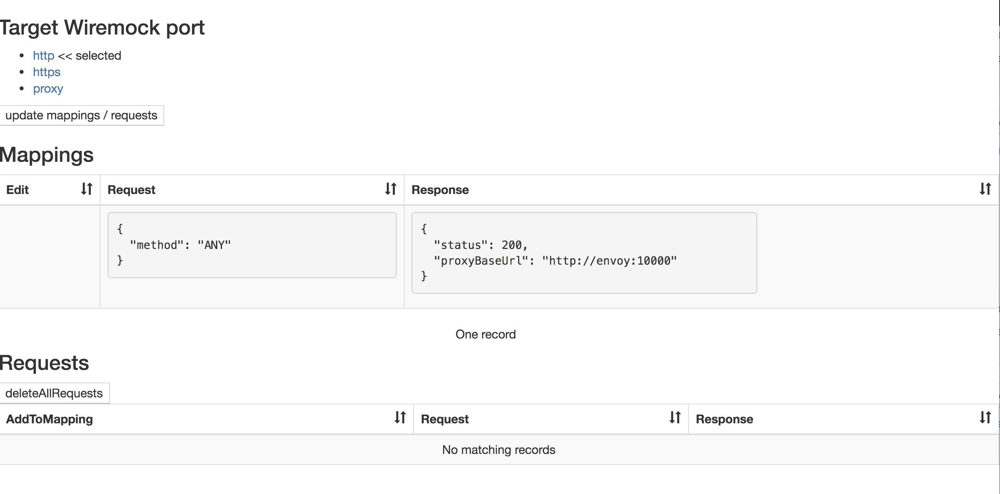
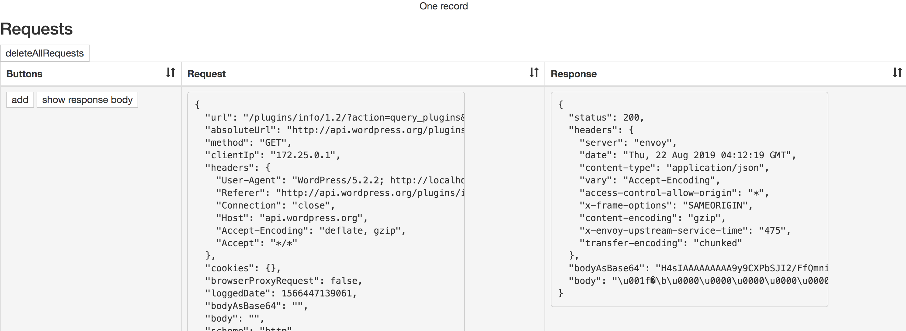
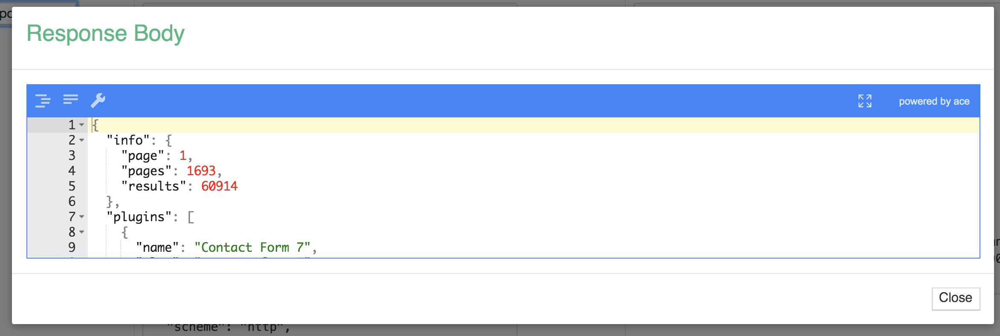
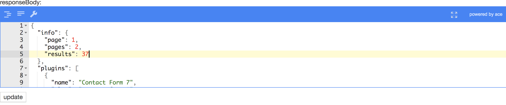
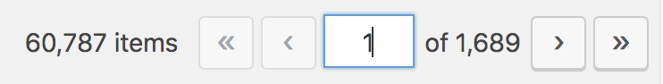

# Overview

## Motivation

For debugging or testing, engineers want to capture API requests and see the requests parameters / responses. And sometimes they want to modify API response for testing instead of manipulating test data.

## What can this do ?

This can 

- record requests/responses for all requests to API
- modify specific response to check the application behavior

without any changes on the application side.

# System Diagram



## Containers

### 1. Target application container

Docker container which runs application that calls API requests.
iptables rules will be set by iptables container to this container's network.

### 2. iptables container

This will be run with target container's network (`--net container:{{container_name}}`). And it sets iptables rules to route all request to specific port (80, 443 and proxy port if it's used) to wiremock's ports.

### 3. wiremock-{http,https}

It runs [Wiremock](https://github.com/tomakehurst/wiremock) and gets requests from target container.
And it passes the requests to envoy container which runs forward proxy.
wiremock cannot route to all requests to several external APIs according to host header.

### 4. envoy (forward-proxy)

It runs [envoy](https://github.com/envoyproxy/envoy) as forward proxy server. It will route the requests to each external API servers according to host header.
Since wiremock can route the request to only one destination with one mapping, this forward proxy routes the request to actual external API servers according to host header.

### 5. wiremock-proxy

This is for proxy requests. If application is calling API through specific proxy, this container will be used.
All requests to specific port will be routed to this container and the requests will be routed to specific external proxy server.

### 6. httpd (UI)

This provides web UI to manage wiremock requests/mappings.

It can 
- List mappings (stub settings or routes settings)
- List requests (recorded requests and response)
- Add mapping settings based on actual request
- Update/Delete mapping

The page consists of pure HTML file and CDN version of Vue.js

# How to use

All containers will be run with `docker-compose`. We need to pass necessary parameters to docker-compose as variables.

## Variables

| Name | Example | Description |
----|----|----
| CONTAINER_NAME | development_web_1 | Target container name (or ID). You can check it with `docker ps -a` command. |
| NETWORK_NAME | development_default | If target container is using custom network (like docker-compose), please specify network name in order to enable container alias name access. Otherwise make it empty. You can check network name by `docker inspect -f '{{.NetworkSettings.Networks}}' ${CONTAINER_NAME}` command. |
| PROXY_URL | http\://your-forward-proxy | Forward proxy server's url. |
| PROXY_PORT | 9000 | Forward proxy server's port. |
| PROXY_TARGET_URL | "http\://target-domain-1 http\://target-domain-2" | API base URLs which are called through `PROXY_URL:PROXY_PORT`. This variable can have multiple values split by spaces. |

Note: `PROXY_XXXX` will be used for proxy-mode (not mandatory).

## Start (without proxy-mode)

```bash
CONTAINER_NAME=##REPLACE HERE## \
NETWORK_NAME=##REPLACE HERE## \
docker-compose up -d
```

## Start (with proxy-mode)

```bash
CONTAINER_NAME=##REPLACE HERE## \
NETWORK_NAME=##REPLACE HERE## \
PROXY_URL=##REPLACE HERE## \
PROXY_PORT=##REPLACE HERE## \
PROXY_TARGET_URL="##REPLACE HERE##" \
docker-compose up -d
```

## Open UI

Go to http://localhost:18000/

## Shutdown

```bash
docker-compose down;
```

# Try it with example application

Try request-catcher with [Wordpress](https://docs.docker.com/compose/wordpress/) on your local.

## Set up wordpress containers
```bash
docker-compose -f example/docker-compose.yaml up -d
```

- Open http://localhost:8000/
- Set up with any values
- Log in to management UI (wp-admin)

## 1. For http request

### Start containers

```bash
CONTAINER_NAME=example_wordpress_1 \
NETWORK_NAME= \
docker-compose up -d
```

### Open request-catcher UI

Open http://localhost:18000/



### Check request/response
- Go to http://localhost:8000/wp-admin/plugin-install.php?s&tab=search&type=term
- Click "update mappings / requests" on http://localhost:18000/

-> You can see Requests and Response



- Click "show response body"

-> You ca see response body



### Modify response
- Click "add" on the "AddToMapping" column on http://localhost:18000/
- Click "update" on "Edit" column
- Modify info.results on "responseBody"

- Click "update"
- Go to http://localhost:8000/wp-admin/plugin-install.php?s&tab=search&type=term

-> The change would be seen on pagination.

#### Before

#### After


## 2. For https request
NOTE: to capture https request, the application needs to IGNORE certification for now.

### Change certification check setting of curl on Wordpress

- Go to http://localhost:8000/wp-admin/theme-editor.php?file=functions.php&theme=twentynineteen
- Add this on the bottom of the file
```
add_action('http_api_curl', function( $handle ){
    curl_setopt($handle, CURLOPT_SSL_VERIFYPEER, false);
    curl_setopt($handle, CURLOPT_SSL_VERIFYHOST, false);
 }, 10);
 ```
- Click "Update File"

### Check request/response
- Click "https" on http://localhost:18000/
- Go to http://localhost:8000/wp-admin/plugin-install.php?s&tab=search&type=term
- Click "update mappings / requests" on http://localhost:18000/

-> You can see Requests and Response of https requests

### Shut down

```bash
docker-compose down;
```

## 3. For Proxy requests

### Start containers

NOTE: You need to specify target API URLs beforehand.
NOTE: Currently https URL cannot be used.

```bash
CONTAINER_NAME=example_wordpress_1 \
NETWORK_NAME=example_default \
PROXY_URL=http://envoy \
PROXY_PORT=10000 \
PROXY_TARGET_URL="http://api.wordpress.org" \
docker-compose up -d
```

### Change proxy setting of curl on Wordpress

- Go to http://localhost:8000/wp-admin/theme-editor.php?file=functions.php&theme=twentynineteen
- Add this on the bottom of the file
```
add_action('http_api_curl', function( $handle ){
    curl_setopt($handle, CURLOPT_PROXY, "envoy");
    curl_setopt($handle, CURLOPT_PROXYPORT, 10000);
 }, 10);
 ```
- Click "Update File"

### Check request/response
- Click "proxy" on http://localhost:18000/
- Go to http://localhost:8000/wp-admin/plugin-install.php?s&tab=search&type=term
- Click "update mappings / requests" on http://localhost:18000/

-> You can see Requests and Response of https requests

### Shut down everything

```bash
docker-compose down;
docker-compose -f example/docker-compose.yaml down;
```

# License

MIT
