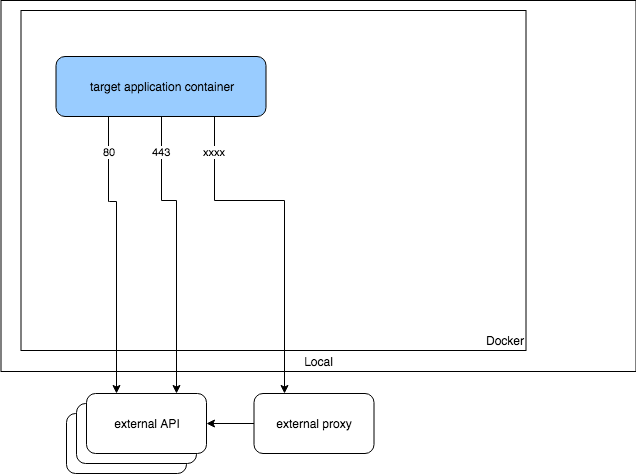
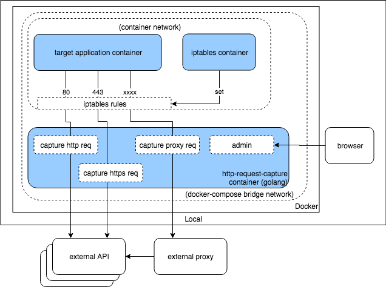

# Overview

## Motivation

For debugging or testing, engineers want to capture API requests and see the requests parameters / responses. And sometimes they want to modify API response for testing instead of manipulating test data.

## What can this do ?

This can 

- record requests/responses for all http requests to API
- modify specific response to check the application behavior

without any changes on the application side.
(to capture https request, application needs to ignore certification error.)

# System Diagram

original | with http-request-capture
:-------------------------:|:-------------------------:
  |  

## Containers

### 1. Target application container

Docker container which runs application that calls API requests.
iptables rules will be set by iptables container to this container's network.

### 2. iptables container

This will be run with target container's network (`--net container:{{container_name}}`). And it sets iptables rules to route all request to specific port (80, 443 and proxy port if it's used) to request capture's ports.

### 3. http-request-capture container

#### 3-1. http request capture

It gets http API requests and passes them to actual API servers. And it records requests/responses. If there is mappings (that can be set by admin API) for a specific request, it returns a pre-set response. 

#### 3-2. https request capture

It's almost same as http request capture.
It provides self-singed certificate. So the application needs to ignore certification error.

#### 3-3. proxy request capture

It's almost same as http request capture.
To capture https requests, it runs MITM (man in the middle) proxy based on [elazarl/goproxy](https://github.com/elazarl/goproxy).

#### 3-4. admin (UI and API)

This provides web UI to manage requests/mappings.

It can 
- List mappings (stub settings or routes settings)
- List requests (recorded requests and response)
- Add mapping settings based on actual request
- Update/Delete mapping

The page consists of pure HTML file and CDN version of Vue.js

# How to use

All containers will be run with `docker-compose`. We need to pass necessary parameters to docker-compose as variables.

## Variables

| Name | Example | Description |
----|----|----
| CONTAINER_NAME | development_web_1 | Target container name (or ID). You can check it with `docker ps -a` command. |
| NETWORK_NAME | development_default | If target container is using custom network (like docker-compose), please specify network name in order to enable container alias name access. Otherwise make it empty. You can check network name by `docker inspect -f '{{.NetworkSettings.Networks}}' ${CONTAINER_NAME}` command. |
| PROXY_URL | http\://your-forward-proxy | Forward proxy server's url. |
| PROXY_PORT | 9000 | Forward proxy server's port. |

Note: `PROXY_XXXX` will be used for proxy-mode (not mandatory).

## Run http-request-capture

### without proxy-mode

```bash
CONTAINER_NAME=##REPLACE HERE## \
NETWORK_NAME=##REPLACE HERE## \
docker-compose up -d
```

### with proxy-mode

```bash
CONTAINER_NAME=##REPLACE HERE## \
NETWORK_NAME=##REPLACE HERE## \
PROXY_URL=##REPLACE HERE## \
PROXY_PORT=##REPLACE HERE## \
docker-compose up -d
```

## Open UI

Go to http://localhost:18080/

## Shutdown

```bash
docker-compose down;
```

# Try it with example application

Try http-request-capture with [Wordpress](https://docs.docker.com/compose/wordpress/) on your local.

## Set up wordpress containers
```bash
docker-compose -f example/docker-compose.yaml up -d
```

- Open http://localhost:8000/
- Set up Wordpress with any values
- Log in to management UI (wp-admin)

## 1. Capture http request

### Start containers

```bash
CONTAINER_NAME=example_wordpress_1 \
NETWORK_NAME= \
docker-compose up -d
```

### Open request-catcher UI

Open http://localhost:18080/


### Check request/response
- Go to http://localhost:8000/wp-admin/plugin-install.php?s&tab=search&type=term
- Click "update mappings / requests" on http://localhost:18080/

-> You can see Requests and Response


- Click "show response body"

-> You can see response body


### Modify response
- Click "add" on the "AddToMapping" column on http://localhost:18080/
- Click "update" on "Edit" column
- Modify info.results on "responseBody"

- Click "update"
- Go to http://localhost:8000/wp-admin/plugin-install.php?s&tab=search&type=term

-> The change would be seen on pagination.

#### Before

#### After


## 2. Capture https request
NOTE: to capture https request, the application needs to IGNORE certification error.

### Change certification check setting of curl on Wordpress

- Go to http://localhost:8000/wp-admin/theme-editor.php?file=functions.php&theme=twentynineteen
- Add this on the bottom of the file
```
add_action('http_api_curl', function( $handle ){
    curl_setopt($handle, CURLOPT_SSL_VERIFYPEER, false);
    curl_setopt($handle, CURLOPT_SSL_VERIFYHOST, false);
 }, 10);
 ```
- Click "Update File"

### Check request/response
- Click "https" on http://localhost:18080/
- Go to http://localhost:8000/wp-admin/plugin-install.php?s&tab=search&type=term
- Click "update mappings / requests" on http://localhost:18080/

-> You can see Requests and Response of https requests

### Shut down

```bash
docker-compose down;
```

## 3. Capture proxy requests

### Start containers

```bash
CONTAINER_NAME=example_wordpress_1 \
NETWORK_NAME=example_default \
PROXY_URL=http://goproxy \
PROXY_PORT=8080 \
docker-compose up -d
```

### Change proxy setting of curl on Wordpress

- Go to http://localhost:8000/wp-admin/theme-editor.php?file=functions.php&theme=twentynineteen
- Add this on the bottom of the file
```
add_action('http_api_curl', function( $handle ){
    $info = curl_getinfo($handle);
    if (strpos($info['url'], '//localhost') === false) {
        curl_setopt($handle, CURLOPT_SSL_VERIFYPEER, false);
        curl_setopt($handle, CURLOPT_SSL_VERIFYHOST, false);
        curl_setopt($handle, CURLOPT_PROXY, "goproxy");
        curl_setopt($handle, CURLOPT_PROXYPORT, 8080);
    }
 }, 10);
 ```
- Click "Update File"

### Check request/response
- Click "proxy" on http://localhost:18080/
- Go to http://localhost:8000/wp-admin/plugin-install.php?s&tab=search&type=term
- Click "update mappings / requests" on http://localhost:18080/

-> You can see Requests and Response of proxy requests

### Shut down everything

```bash
docker-compose down;
docker-compose -f example/docker-compose.yaml down;
```

# License

MIT
